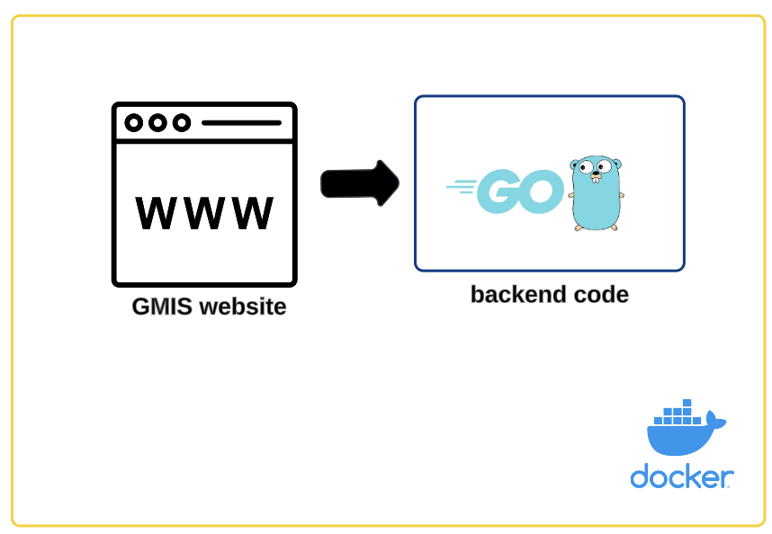

# Project Name: Group Member Information System (GMIS)

**Description:**
The **_Group Member Information System (GMIS)_** is a web application designed to showcase group members and their detailed profiles. It allows users to view team members' names, roles, contact details, and other relevant information. The website serves as a central directory for team or organization members, making it easy to get information about colleagues, their responsibilities, and contact details. It enhances collaboration and streamlines team management through a simple, accessible interface.

## Project Overview

### Architecture

The **_Group Member Information System (GMIS)_** web application has the following components:

| **Component** | **Description**                                                                                                                                                                                        |
| ------------- | ------------------------------------------------------------------------------------------------------------------------------------------------------------------------------------------------------ |
| **Website**   | Contains the front-end resources, including HTML, CSS, and image files, responsible for rendering the user interface and ensuring an interactive user experience.                                      |
| **Go**        | Implements the backend logic, serving as the web server that handles the HTTP requests.                                                                                                                |
| **Docker**    | Manages application deployment by containerizing the entire application, ensuring consistency across environments and simplifying the process of scaling, versioning, and maintaining the application. |

The following diagram shows the high-level architecture of the web application:


## Technical Details

### Website

The website is organized in the following folder structure:

| **Folder** | **Description**                                                                                                                                   |
| ---------- | ------------------------------------------------------------------------------------------------------------------------------------------------- |
| **css**    | Contains cascading style sheets (CSS) that define the visual styling of the website, including layout, colors, typography, and responsiveness.    |
| **img**    | Stores all image assets used in the website, such as the individual team members profile pictures.                                                |
| **pages**  | Contains the HTML files representing individual web pages of the site, each defining the structure and content for specific sections or features. |

### Go Code

The code imports two packages:

- `log`: To log errors and manage server startup.
- `net/http`: To handle HTTP requests and serve files.

#### Main Function

The `main` function does the following:

1. **Create a File Server**:

   - The `http.FileServer` serves static files from the `./site` directory.
   - The `http.Handle("/", fs)` maps the `/` route to the file server.

2. **Start the Server**:

   - `http.ListenAndServe(":80", nil)` starts the server on port `80`.

3. **Error Handling**:
   - `log.Fatal` is used to log any fatal error that occurs during server startup.

### Example Usage

1. Place static files in a directory named `site`.
2. Run the program, which will start the HTTP server on port 80.
3. Access the files via a web browser by navigating to `http://localhost`.

### Commands:

#### Go

```bash
 go mod init path #<path>

 go build .

 ./filename    #<filename>
```

#### Docker

```bash
 docker build -t gpa_w11:v1 .

 docker run -p 80:80 gpa_w11:v1

 #the docker image : docker.io/dipansus/gpa_w11
```

# Unit Test Scenarios for GMIS

## Unit Test Scenario Summary

The table below provides an overview of the GMIS test scenarios along with their corresponding results:

| **Test Id**                  | **Description**                                                    | **Result** |
| ---------------------------- | ------------------------------------------------------------------ | ---------- |
| **TestServerInitialization** | Test server initialization to ensure it listens on port 80.        | PASS       |
| **TestFileServing**          | Verify that static files are served correctly (File Server Route). | PASS       |
| **TestDirectoryBrowsing**    | Ensure directory browsing is disabled and returns 403 Forbidden.   | PASS       |

## Unit Test Scenario Details

### T001 Testing HTTP Server Initialization

- **Objective**: Verify the server initializes and listens on the correct port.
- **Test Steps**:
  1. Mock the HTTP server initialization.
  2. Verify that `http.ListenAndServe` is called with `":80"` and no errors are returned.
- **Expected Result**: The server starts without errors and listens on port `80`.

---

### T002 Testing File Server Route (Static File Serving)

- **Objective**: Ensure the file server serves static files correctly.
- **Test Steps**:
  1. Send a `GET` request to `/`.
  2. Mock the file system with some static files under the `./site` directory.
  3. Verify the response status code is `200 OK`.
  4. Check if the returned content matches the requested file.
- **Expected Result**: Static files are served correctly, and the appropriate content is returned with `200 OK`.

---

### T003 Handling Missing Files

- **Objective**: Verify the server returns `404 Not Found` for non-existent files.
- **Test Steps**:
  1. Send a `GET` request to a non-existent file, e.g., `/nonexistent.html`.
  2. Verify the response status code is `404 Not Found`.
- **Expected Result**: The server handles missing files gracefully and returns `404 Not Found`.

---

### T004 Directory Browsing Security

- **Objective**: Ensure that directory browsing is disabled.
- **Test Steps**:
  1. Send a `GET` request to `/` or any directory path, e.g., `/img/`.
  2. Check if directory contents are exposed.
- **Expected Result**: Directory contents are not listed, and the server responds with `403 Forbidden` or an appropriate error.

---

### T005 Testing MIME Type Handling

- **Objective**: Verify the server returns the correct `Content-Type` for various file types.
- **Test Steps**:
  1. Request files with extensions `.html`, `.css`, `.js`, `.png`, `.jpg`, etc.
  2. Inspect the `Content-Type` header in the response.
- **Expected Result**: Correct MIME types are returned for all file types.

---

### T006 Performance Testing

- **Objective**: Verify the server can handle concurrent requests without failure.
- **Test Steps**:
  1. Simulate multiple concurrent `GET` requests to `/`, `/css/style.css`, `/pages/member.html`, etc.
  2. Monitor response times and error rates.
- **Expected Result**: The server handles concurrent requests efficiently, and all responses are successful.

---

### T007 Edge Case Testing for Large Files

- **Objective**: Ensure the server handles large file transfers without crashing.
- **Test Steps**:
  1. Place a large file (e.g., >10MB) in the `./site` directory.
  2. Request the large file and verify it is delivered completely.
- **Expected Result**: The server successfully delivers large files without interruption.

---

### T008 Security Testing

- **Objective**: Ensure the server is protected against common vulnerabilities.
- **Test Cases**:
  - **Path Traversal**: Send a request like `/../main.go` and verify it is blocked.
  - **Malformed Requests**: Send invalid HTTP requests and verify the server handles them gracefully.
  - **Injection Attacks**: Attempt to inject malicious code into requests and ensure it is not executed.
- **Expected Result**: The server rejects all malicious requests securely.

---

### T009 Graceful Error Handling

- **Objective**: Test that the server provides user-friendly error messages for unexpected issues.
- **Test Steps**:
  1. Simulate server errors (e.g., by removing a required file).
  2. Verify that a clear and user-friendly error page is displayed instead of a raw error.
- **Expected Result**: Friendly error messages are shown to users.

---

### T0010 Test Configuration Flexibility

- **Objective**: Ensure the server configuration can be adjusted easily.
- **Test Steps**:
  1. Mock configurations for port, directory paths, etc.
  2. Start the server with different configurations and verify behavior.
- **Expected Result**: The server adapts to configuration changes without issues.

---

### T0011 Integration with a Reverse Proxy (Optional)

- **Objective**: Ensure compatibility with reverse proxies like Nginx or Apache.
- **Test Steps**:
  1. Set up a reverse proxy to forward requests to the server.
  2. Verify all routes function correctly through the proxy.
- **Expected Result**: The server operates seamlessly behind a reverse proxy.

# Issue/Enhancement Tracking

## Issues

The table below shows the issues and bugs encountered in the application

| **Issue ID** | **Description**                                        | **Assignee** | **Priority** | **Status** | **Status Date** | **Comments** |
| ------------ | ------------------------------------------------------ | ------------ | ------------ | ---------- | --------------- | ------------ |
| **I001**     | Piyush Iyer: Incorrect profile image and LinkedIn link | Swaroop      | High         | New        | 18-Nov-2024     |              |

## Enhancements

The table below outlines the enhancements for the application

| **Enhancement ID** | **Description**                                                                                                          | **Assignee** | **Priority** | **Status** | **Status Date** | **Completion Date** | **Comments**            |
| ------------------ | ------------------------------------------------------------------------------------------------------------------------ | ------------ | ------------ | ---------- | --------------- | ------------------- | ----------------------- |
| **E001**           | Display the team member's role under their name on the main page                                                         | Swaroop      | Medium       | New        | 18-Nov-2024     | TBD                 | Awaiting implementation |
| **E002**           | Rearrange the team members in this order: Project Manager, Lead Developer, Developers, Testers, Documentation Specialist | Swaroop      | High         | New        | 18-Nov-2024     | TBD                 | Awaiting implementation |
